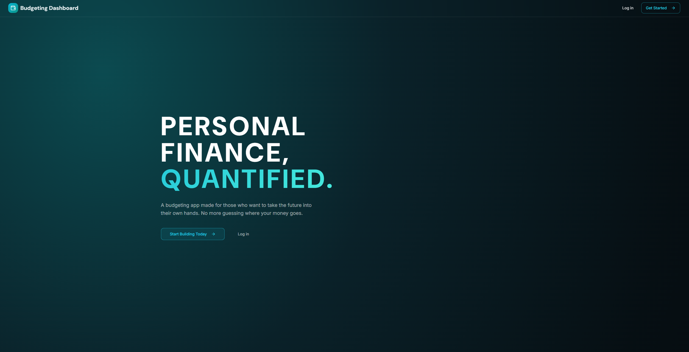
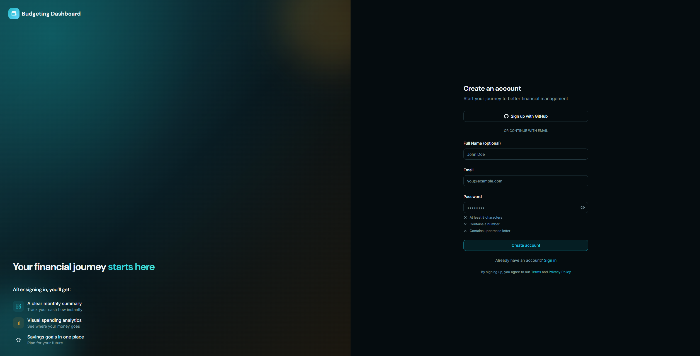
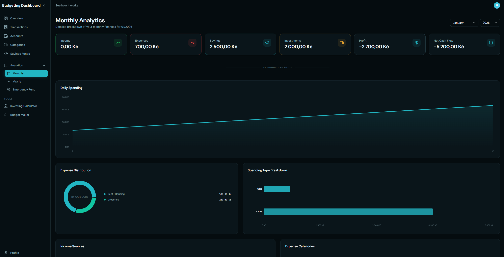
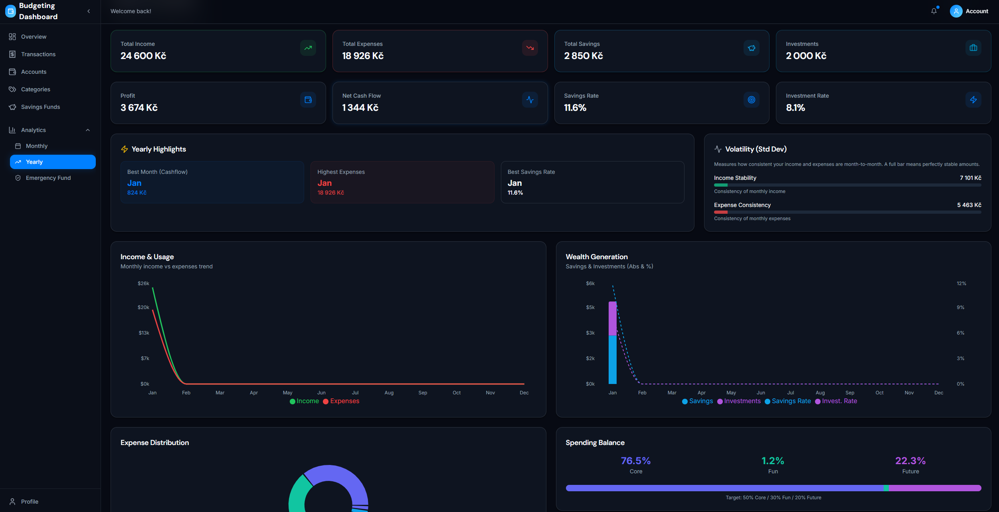
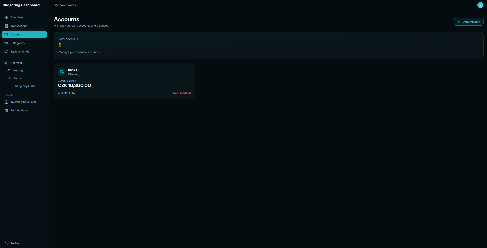
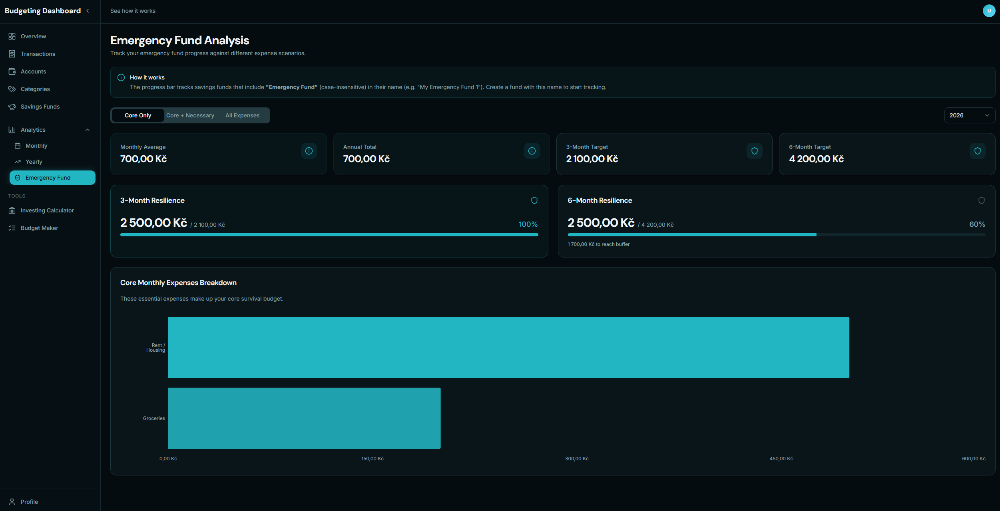

# Budgeting Dashboard

[](https://budgeting-dashboard-site.onrender.com)

## Tech Stack

### **Frontend**


- **React** - UI Library
- **Vite** - Build tool
- **TailwindCSS** - Utility-first CSS framework
- **Recharts** - Composable charting library for React components

### **Backend**


- **FastAPI** - High-performance async API framework
- **Pydantic** - Data validation and serialization
- **PyJWT** - JSON Web Token implementation
- **Polars** - Blazingly fast DataFrames

### **Database & Infrastructure**


- **Supabase** - PostgreSQL database with auth handling

## CI/CD Pipeline

This project uses a CI/CD workflow built with **GitHub Actions** and **Render**:

- **CI (GitHub Actions):** on every push/PR to `main`, the pipeline runs backend type-checking + tests and frontend lint/type-check/build.
- **CD (Render):** deployments are triggered **only after CI passes**, ensuring the live services update from verified builds.

---

### **Development Process**

To accelerate development, the first version of the UI was scaffolded using Lovable.
From there, the application was iteratively redesigned, extended, and connected to a custom backend API, including authentication, analytics endpoints, and state handling.

The final implementation reflects deliberate architectural and UX decisions beyond the initial scaffold.

Crucially, the entire backend and database development was performed manually, ensuring a robust and custom-tailored solution.

## Screenshots

| Landing Page | Registration |
|:------------------:|:---------------------:|
|  |  |
| Welcome screen and dashboard entry | Secure user registration |

| Monthly Analytics | Yearly Analytics |
|:------------------:|:--------------------:|
|  |  |
| Detailed monthly breakdown | Long-term trend analysis |

| Accounts Overview | Emergency Fund |
|:-----------------:|:-----------------:|
|  |  |
| Comprehensive accounts management | dedicated emergency fund tracking |

## Project Structure

```bash
budgeting_dashboard/
├── src/
│   ├── backend/                    # FastAPI backend
│   │   ├── backend_server.py       # Main application
│   │   ├── Dockerfile              # Dockerfile for backend
│   │   ├── auth/                   # Authentication
│   │   ├── routers/                # API endpoints
│   │   ├── schemas/                # Data models
│   │   └── helper/                 # Utilities
│   ├── frontend/                   # React + Vite frontend
│   │   ├── src/
│   │   │   ├── main.tsx            # Application entry point
│   │   │   ├── components/         # UI components
│   │   │   ├── pages/              # Application pages
│   │   │   └── lib/                # Utilities
│   └── tests/                      # Automated tests
├── screenshots/                    # Application screenshots
├── docs/                           # Documentation
└── README.md
```

### **Real-World Application**

- **Problem Solving** - Addresses genuine personal finance management needs with intuitive design
- **Production Ready** - Live deployed application with proper error handling and environment configuration

### **Modern Development Practices**

- **RESTful API Design** - Well-structured endpoints following REST principles with Pydantic validation
- **Data Visualization** - Interactive charts and analytics using modern visualization libraries

This application showcases the ability to **transform complex financial requirements into an elegant, user-friendly solution** while maintaining high standards for security, performance, and code quality.

## License

This project is licensed under the **MIT License** - see the [LICENSE](./LICENSE) file for details.
