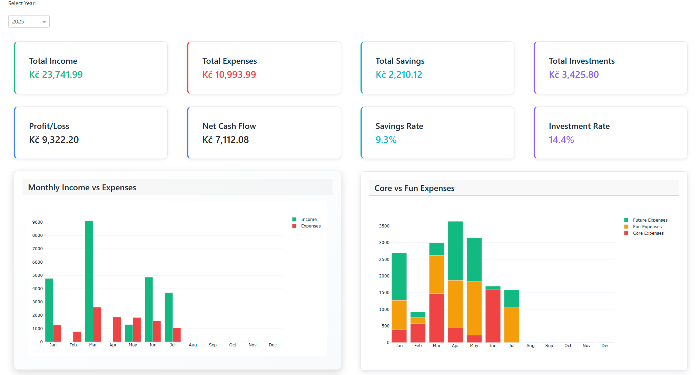
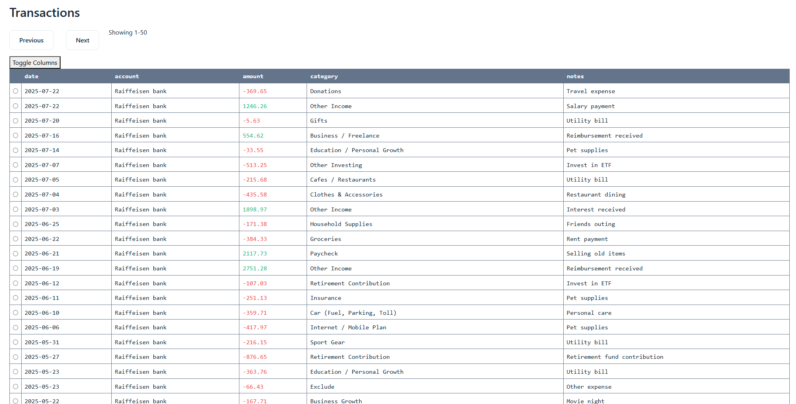
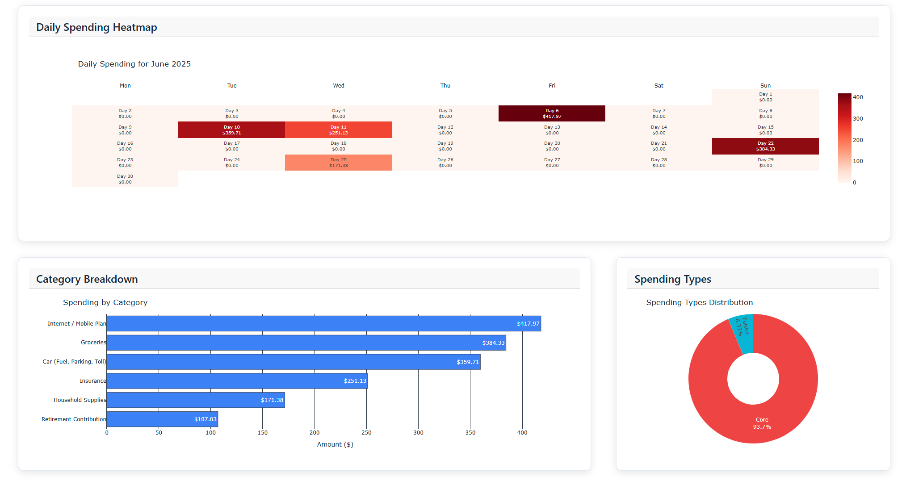
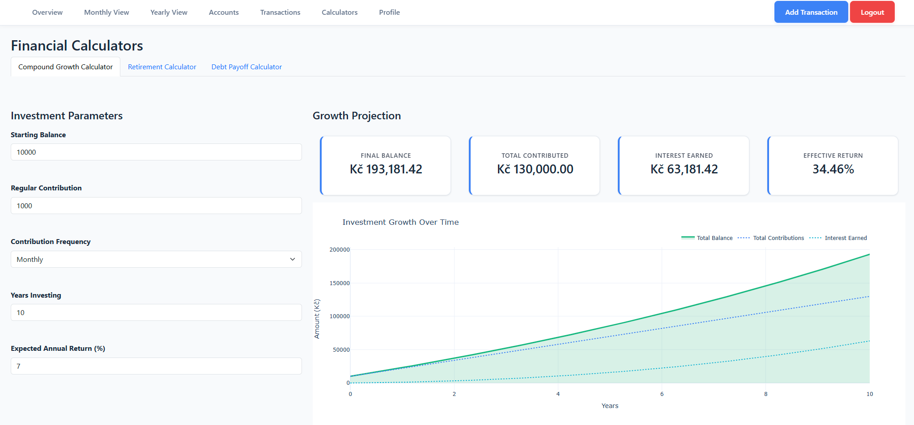
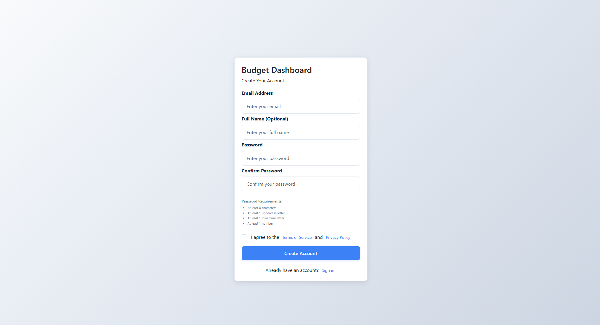
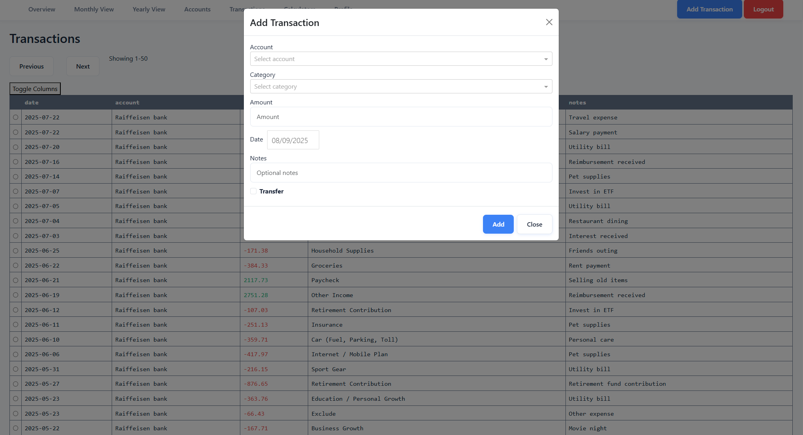

# 💰 Budgeting Dashboard

*A comprehensive personal finance analytics web application for smart money management*

[](https://budgeting-dashboard-frontend.onrender.com)

## 🛠 Tech Stack

### **Frontend**


- **Plotly Dash** - Interactive web framework
- **Dash Bootstrap Components** - Responsive UI components
- **Plotly** - Advanced data visualizations

### **Backend**


- **FastAPI** - High-performance async API framework
- **Pydantic** - Data validation and serialization
- **PyJWT** - JSON Web Token implementation
- **Pandas** - Data manipulation and analysis

### **Database & Infrastructure**


- **Supabase** - Backend-as-a-Service with PostgreSQL
- **Row-Level Security (RLS)** - Database-level security policies

## 📸 Screenshots

| Dashboard Overview | Transaction Management |
|:------------------:|:---------------------:|
|  |  |
| Main dashboard with key metrics | Complete transaction CRUD interface |

| Analytics & Reports | Investment Calculator |
|:------------------:|:--------------------:|
|  |  |
| Detailed financial analytics | Growth projection tools |

| User Registration | Transaction Modals |
|:-----------------:|:-----------------:|
|  |  |
| Secure user onboarding | Intuitive data entry |

## 📁 Project Structure

```text
budgeting_dashboard/
├── src/
│   ├── backend/                 # FastAPI backend
│   │   ├── backend_server.py    # Main application
│   │   ├── auth/               # Authentication
│   │   ├── routers/            # API endpoints
│   │   ├── schemas/            # Data models
│   │   └── helper/             # Utilities
│   └── frontend/               # Plotly Dash frontend
│       ├── main.py             # Main application
│       ├── components/         # UI components
│       ├── pages/              # Application pages
│       └── helper/             # Frontend utilities
├── scripts/                    # Deployment scripts
├── screenshots/                # Application screenshots
└── README.md
```

## 🎯 Portfolio Highlight

This project demonstrates comprehensive **full-stack development expertise** across multiple domains:

### **Technical Excellence**

- **🏗 Architecture Design** - Clean separation between FastAPI backend and Plotly Dash frontend
- **🔒 Security Implementation** - JWT authentication with refresh tokens and database-level Row-Level Security

### **Real-World Application**

- **💡 Problem Solving** - Addresses genuine personal finance management needs with intuitive design
- **🚀 Production Ready** - Live deployed application with proper error handling and environment configuration

### **Modern Development Practices**

- **🔄 RESTful API Design** - Well-structured endpoints following REST principles with Pydantic validation
- **📊 Data Visualization** - Interactive charts and analytics using modern visualization libraries

This application showcases the ability to **transform complex financial requirements into an elegant, user-friendly solution** while maintaining high standards for security, performance, and code quality.

## 📄 License

This project is licensed under the **MIT License** - see the [LICENSE](./LICENSE) file for details.
